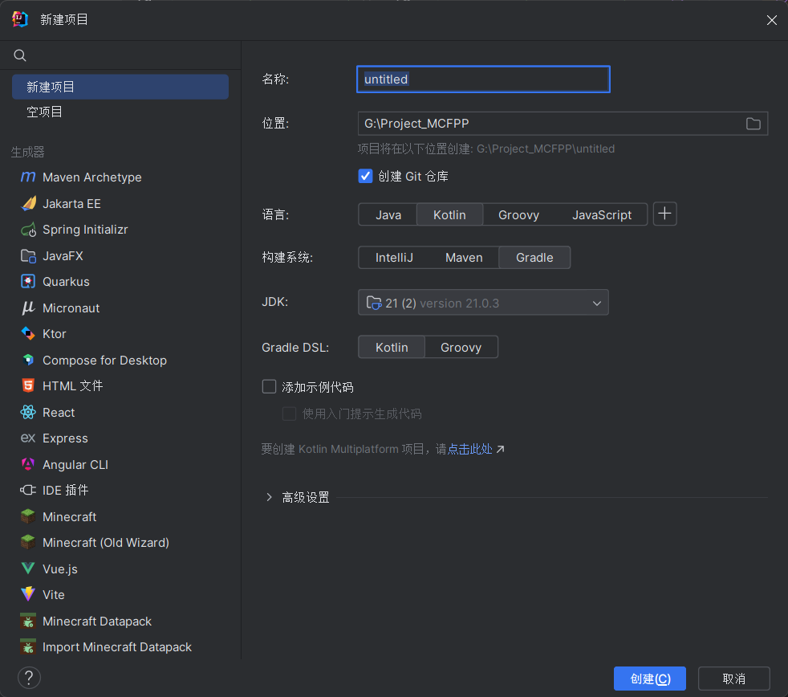

# Getting Started

MCFPP currently offers two usage methods: directly using the command line or building with Gradle. For simple functionalities, the command line is recommended. Gradle provides more extensive support, such as MNI.

## Compiling with Command Line

You can download the latest version of the MCFPP compiler from the release page on [GitHub](https://github.com/MinecraftFunctionPlusPlus/MCFPP/releases), which should be a Jar file. MCFPP requires Java 21 or higher. You can place it anywhere as long as you can locate it in the command line.

First, create a project folder and a project configuration file. You can find the detailed format of the project configuration file in the next section. In this example, we create an `example.json` as the project configuration file.

```json
{
  "description": "",
  "namespace": "mcfpp",
  "targetPath": "D:\\.minecraft\\saves\\MCFPP Example\\datapacks"
}
```

Next, create a simple mcfpp file, such as `example.mcfpp`:

```mcfpp
func hello(){
    print("Hello World");
}
```

Then, compile the project using the command line:

```shell
java -jar mcfpp.jar example.json
```

This command compiles `example.mcfpp` into a data pack and outputs it to the `D:\.minecraft\saves\MCFPP Example\datapacks` directory. You can then load the data pack in the game and run `function mcfpp:hello` to see the effect.

## Building with Gradle

:::warning
This content has been translated by AI. We welcome native speakers to help improve the translation.
:::

The Gradle-based MCFPP project has additional feature support.

:::tip
This example uses IntelliJ IDEA and the Gradle DSL in Kotlin.

Example project: <https://github.com/MinecraftFunctionPlusPlus/MCFPP_Example>
:::

To build an MCFPP project with Gradle, first create an empty Java or Kotlin project. MCFPP supports both, but since it’s written in Kotlin, using Kotlin gives a better development experience.



After the project is created and loaded, open `build.gradle.kts` and add MCFPP support as follows:

```kt
plugins {
    // ...existing code
    // add the MCFPP plugin
    id("mcfpp-gradle") version "1.0.2-SNAPSHOT"
}

repositories {
    // ...existing code
    // add repositories required by MCFPP and where MCFPP is hosted
    maven("https://nexus.mcfpp.top/repository/maven-public/")
    maven("https://jitpack.io")
    maven("https://maven.aliyun.com/nexus/content/groups/public/")
    maven("https://libraries.minecraft.net")
}

group = "top.mcfpp"
version = "1.0-SNAPSHOT"

dependencies {
    // ...existing code
    // add the MCFPP library. If you don't use MCFPP MNI you can omit this line
    implementation("top.mcfpp:mcfpp:1.0.2-SNAPSHOT")
}
```

Then open `settings.gradle.kts` and add:

```kt
// add repositories for plugin dependencies and the plugin itself
pluginManagement {
    repositories {
        maven("https://nexus.mcfpp.top/repository/maven-public/")
        maven("https://jitpack.io")
        maven("https://maven.aliyun.com/nexus/content/groups/public/")
        maven("https://libraries.minecraft.net")
        gradlePluginPortal()
    }
}
```

Reload the Gradle project. If everything is OK, you’ve successfully added MCFPP support to Gradle. MCFPP will by default read mcfpp files from src/main/mcfpp, so create that folder and write your MCFPP code there.

When using Gradle you don’t need to create project configuration JSON files. Instead you can configure MCFPP in build.gradle.kts using the mcfpp block:

```kt
mcfpp {
    version = "1.21.4"
    description = "MCFPP Example Project"
}
```

This block sets the config field of the `Project` class. That field is an instance of[`ProjectConfig`](https://github.com/MinecraftFunctionPlusPlus/MCFPP/blob/kotlin-latest/src/main/kotlin/top/mcfpp/ProjectConfig.kt) and manages MCFPP project settings.

Field | Type | Default | Description
-|-|-|-
version | String | "1.21.8" | Minecraft version for the project. Only official releases supported (no snapshots).
rootNamespace | String | "default" | Default namespace for the project.
targetPath | java.nio.file.Path? | null | Output folder for the datapack. If null: when using a config file it's `$root/build/`, when using Gradle it's the Gradle build output `datapack` folder (usually `build/datapack`).
commentLevel | top.mcfpp.command.CommandLevel | CommentLevel.DEBUG | Comment output level.
root | java.nio.file.Path? | null | Project root. If null, it's the directory of the config JSON or the Gradle project root.
name | String | "new_mcfpp_project" | Project name.
description | String | "A new datapack" | Datapack description.
includes | ArrayList<String> | ArrayList() | All referenced includes.
jars | ArrayList<String> | ArrayList() | Paths to all jar files.
sourcePath | java.nio.file.Path? | null | Root of MCFPP source. If null: when using a config file it's `$root`; with Gradle it's `src/main/mcfpp`.
noDatapack | Boolean | false | Do not generate a datapack.
copyImport | Boolean | true | Copy imported libraries when generating the datapack.

Finally, run the `mcfppCompile` task found under the `build` Gradle tasks to compile the project into a datapack.