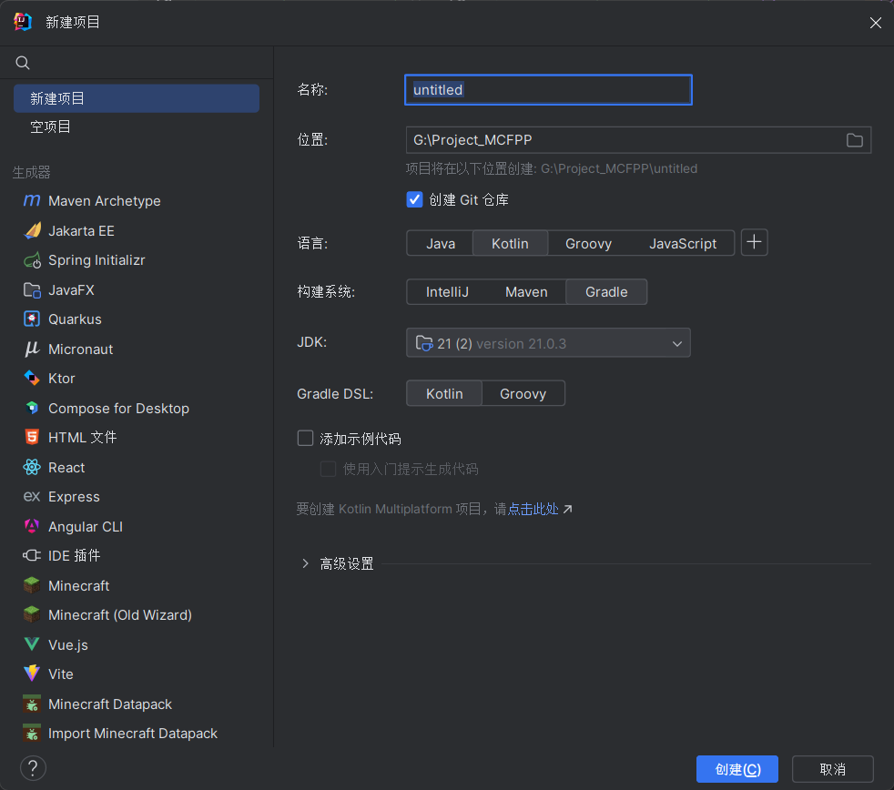

# 开始使用

MCFPP目前提供了两种使用方法：直接使用命令行，或者借助Gradle进行构建。如果只是使用简单的功能，推荐使用命令行。Gradle则提供了更多的功能支持，例如MNI。

## 使用命令行编译

你可以从Github的发布页下载到最新的MCFPP编译器版本，它应当是一个Jar文件。MCFPP的运行需要Java 21或更高版本。你可以将它放在任何地方，只要你能在命令行中找到它。

首先，你需要创建一个项目文件夹，同时创建一个工程配置文件。在下一节中，你可以找到有关工程配置文件的详细格式。在本例中，我们创建了一个`example.json`作为工程配置文件。

```json
{
  "description": "",
  "namespace": "mcfpp",
  "targetPath": "D:\\.minecraft\\saves\\MCFPP Example\\datapacks"
}
```

随后，我们创建一个简单的mcfpp文件，例如`example.mcfpp`：

```mcfpp
func hello {
    print("Hello World");
}
```

接下来，我们可以使用命令行编译这个项目：

```shell
java -jar mcfpp.jar example.json
```

这个命令会将`example.mcfpp`编译为一个数据包，并输出到`D:\.minecraft\saves\MCFPP Example\datapacks`目录下。随后，你可以进入游戏加载这个数据包，并运行`function mcfpp:hello`来查看效果。

## 使用Gradle构建

基于Gradle的MCFPP项目拥有更多的功能支持。

:::tip
本例使用IntelliJ Idea，Gradle DSL使用Kotlin
:::

要使用Gradle构建MCFPP项目，首先需要创建一个空白的Java项目或Kotlin项目。MCFPP支持Java和Kotlin，但是由于本身由Kotlin编写，使用Kotlin可以获得更好的编写体验。



创建项目后，等待项目加载完成，打开`build.gradle.kts`。按照如下配置Gradle以添加MCFPP相关支持：

```kt
plugins {
    // ...已有的代码
    //添加MCFPP插件
    id("mcfpp-gradle") version "1.0.2-SNAPSHOT"
}

repositories {
    // ...已有的代码
    // 添加MCFPP所需要的依赖库的仓库地址以及MCFPP所在库的地址
    maven("https://nexus.mcfpp.top/repository/maven-public/")
    maven("https://jitpack.io")
    maven("https://maven.aliyun.com/nexus/content/groups/public/")
    maven("https://libraries.minecraft.net")
}

group = "top.mcfpp"
version = "1.0-SNAPSHOT"

dependencies {
    // ...已有的代码
    // 添加MCFPP库。如果不使用MCFPP MNI可不添加本行
    implementation("top.mcfpp:mcfpp:1.0.2-SNAPSHOT")
}
```

随后，打开`settings.gradle.kts`，添加如下配置：

```kt
//添加插件需要的依赖库的地址，以及插件所在的库的地址
pluginManagement {
    repositories {
        maven("https://nexus.mcfpp.top/repository/maven-public/")
        maven("https://jitpack.io")
        maven("https://maven.aliyun.com/nexus/content/groups/public/")
        maven("https://libraries.minecraft.net")
        gradlePluginPortal()
    }
}
```

然后，重新加载gradle项目，如果一切正常，你就成功地为Gradle添加了MCFPP支持。MCFPP默认会读取`src/main/mcfpp`中的mcfpp文件，所以你需要在对应的位置新建这个文件夹，在其中编写MCFPP。

使用Gradle时候，你不需要编写项目配置相关的json文件。对应的，你可以在`build.gradle.kts`中对MCFPP项目进行配置。使用`mcfpp`方法块配置你的项目：

```kt
mcfpp {
    version = "1.21.4"
    description = "MCFPP Example Project"
}
```

事实上此方法块修改的是`Project`类中的`config`字段。此字段是[`ProjectConfig`](https://github.com/MinecraftFunctionPlusPlus/MCFPP/blob/kotlin-latest/src/main/kotlin/top/mcfpp/ProjectConfig.kt)的实例，其管理了MCFPP项目的各项配置。

|字段名|类型|默认值|描述|
|-|-|-|-|
|version|String|"1.21.8"|工程对应的mc版本。仅支持正式版本，不支持快照|
|rootNamespace|String|"default"|工程的默认命名空间|
|targetPath|java.nio.file.Path?|null|数据包输出的文件夹。若为空，在使用配置文件的时候为`$root/build/`，使用Gradle时为Gradle构建产出目录的`datapack`文件夹中（通常为`build/datapack`）|
|commentLevel|top.mcfpp.command.CommandLevel|CommentLevel.DEBUG|注释输出等级|
|root|java.nio.file.Path?|null|工程的根目录。若为空，则为配置json文件所在的目录，或Gradle项目的根目录|
|name|String|"new_mcfpp_project"|工程的名字|
|description|String|"A new datapack"|数据包的描述|
|includes|ArrayList\<String>|ArrayList()|工程包含的所有引用|
|jars|ArrayList\<String>|ArrayList()|所有Jar文件的路径|
|sourcePath|java.nio.file.Path?|null|mcfpp源代码根目录。若为空，在使用配置文件的时候为`$root`，在使用Gradle时为`src/main/mcfpp`|
|noDatapack|Boolean|false|不生成数据包|
|copyImport|Boolean|true|生成数据包的时候复制导入的库|

你可以在gradle任务的`build`分类下找到名为`mcfppCompile`的任务。
